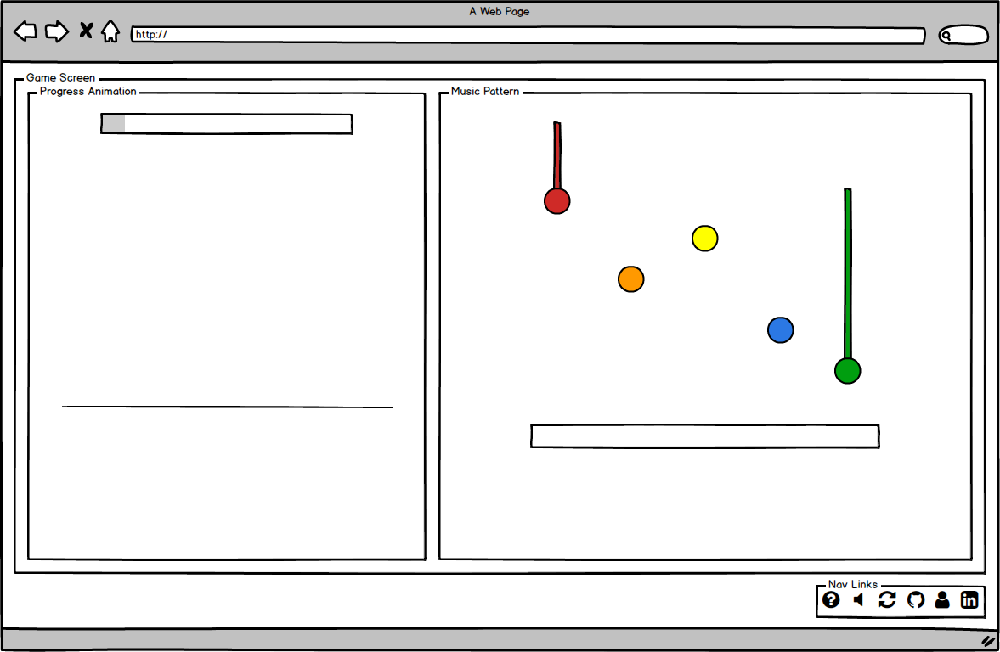

## Wolfgang

### Background

Wolfgang is an violin-specific adaptation of Guitar Hero, named after the famous composer Wolfgang Amadeus Mozart. In the original Guitar Hero, players press the buttons and the strum tab on the guitar controller according to the pattern shown on the screen. This project will incorporate the core concept but adjusted slightly to incorporate the mechanics of violin, such as the concept of bowing (instead of strumming).

### Functionality & Minimum Viable Product (MVP)

With Wolfgang, users will be able to:

- [ ] Start and reset the game
- [ ] Play or mute the sound
- [ ] Press computer keys to match the falling block pattern to the music.
- [ ] Visualized pattern matching score
- [ ] Animation when keys are pressed

In addition, this project will include:

- [ ] A production README

### Wireframes

This app will consist of a single screen with game board, game, controls, and nav links to the Github, LinkedIn, and Portfolio.
Game controls will include Start and Reset, and Mute buttons.

### Architecture and Technologies

This project will be implemented with the following technologies:

- Vanilla JavaScript and `jquery` for overall structure and game logic,
- Webpack to bundle and serve up the various scripts,
- `Howler.js` for audio,
- `HTML5 Canvas` for DOM manipulation and rendering,
- `anime.js` to create animations for keydown event.
- `Easel.js` to create progress animation.

In addition to the webpack entry file, there will be multiple scripts involved in this project:

`animations.js`: this script will create special effects on key press.

`progress.js`: this script will create the animation for the progress tracking.

`keycodes.js`: this script will handle the keys.

`sounds.js`: this script will connect the keys to sound files.

`main.js`: this script will handle the logic for the board and rendering.

`blocks.js`: this script will house the constructor and update functions for the `Block` objects.  Each `Block` will contain a `note` (violin notes), `time` (at which it should be played), and `hit` (`true` or `false`).

`utils.js`: this script will handle vector math for the blocks.

### Implementation Timeline

**Day 1**: Setup all necessary Node modules, including getting webpack up and running.  Create `webpack.config.js` as well as `package.json`.  Write a basic entry file and the bare bones of all scripts outlined above.  Learn the basics of `anime.js`, and `Easel.js`.  Goals for the day:

- Get a working bundle with `webpack`
- Render an object to the `Canvas` element
- Start figuring out progress animations using `Easel.js`

**Day 2**: Dedicate this day to creating violin and blocks. Goals for the day:

- Complete the `blocks.js` module (constructor, update functions)
- Render a background to the `Canvas`
- Render a functioning violin object connected to sounds

**Day 3**: Create the blocks moving according to a song. Goals for the day:

- Build DB on notes and timestamps to create velocity for each block.
- Build interaction between the blocks and key pressed with violin to keep track of score based on hit/miss, as well as duration.

**Day 4**: Install the controls for the user to interact with the game.  Style the frontend. Goals for the day:

- Create controls for start, reset
- Have a styled `Canvas`, nice looking controls and title

### Bonus features

Some future implementations for this game include:

- [ ] Add options for faster speed
- [ ] Add options for different songs
